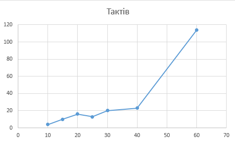
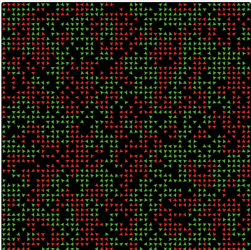
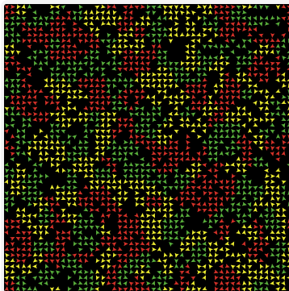
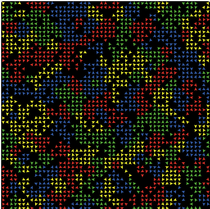
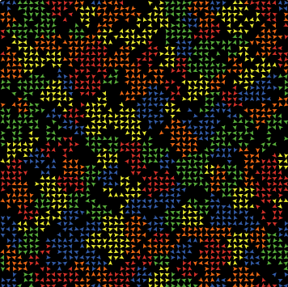
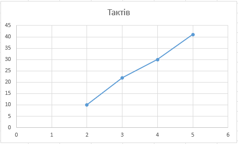
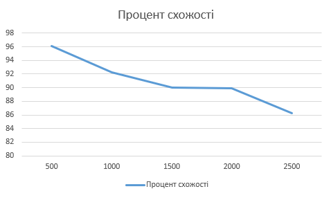

## Комп'ютерні системи імітаційного моделювання
## СПм-24-1, **Яровий Валерій Вікторович**
### Лабораторна робота №**1**. Опис імітаційних моделей та проведення обчислювальних експериментів

 

### Варіант 8 - Модель досліджує прагнення "групуватися" із "своїми" і толерантність до чужаків.
[Segregation Simple Extension 1](https://www.netlogoweb.org/launch#http://www.netlogoweb.org/assets/modelslib/IABM%20Textbook/chapter%203/Segregation%20Extensions/Segregation%20Simple%20Extension%201.nlogo)

 

## Вербальний опис моделі
Модель відтворює процес **соціальної сегрегації агентів різних груп** у двовимірному просторі. Агенти (черепашки) випадково розміщуються на сітці та належать до однієї з кількох груп, які відрізняються кольором.  
Кожен агент аналізує своє локальне оточення і визначає, чи достатня частка його сусідів належить до тієї ж групи, що й він сам. Якщо ця частка нижча за заданий поріг **%-similar-wanted**, агент вважає себе незадоволеним і переміщується у випадкове вільне місце.  
У результаті багаторазового повторення таких локальних рішень виникає **глобальна сегрегація** - агенти одного кольору формують просторові кластери навіть за помірних індивідуальних вимог.

## Керуючі параметри
- **number**  
	Кількість агентів у моделі. Впливає на щільність середовища та швидкість формування сегрегованих структур.
- **%-similar-wanted**  
	Мінімальний відсоток сусідів того ж кольору, необхідний агенту для того, щоб вважати себе щасливим. Чим більше значення, тим сильніша сегрегація.
- **number-of-ethnicities**  
	Кількість різних груп агентів. Колір кожного агента випадково обирається зі списку `colors`. Збільшення значення ускладнює структуру сегрегації.

## Внутрішні параметри (глобальні змінні)
- **percent-similar**  
	Середній відсоток сусідів того ж кольору для всіх агентів у системі.
- **percent-unhappy**  
	Відсоток агентів, які незадоволені своїм оточенням на поточному кроці моделювання.
- **colors**  
	Список можливих кольорів агентів:  
	`red, green, yellow, blue, orange`.

## Внутрішні параметри агентів
- **happy?**  
	Логічна змінна, що показує, чи задоволений агент своїм оточенням.
- **similar-nearby**  
	Кількість сусідів того ж кольору, що й агент.
- **total-nearby**  
	Загальна кількість сусідів незалежно від їх групи.

## Показники роботи системи

- **percent-similar**  
Середній відсоток сусідів того ж кольору для всіх агентів у моделі.  
Є основним кількісним показником рівня сегрегації: чим більше значення, тим сильніше просторове розділення груп.
- **percent-unhappy**  
	Відсоток агентів, які не задоволені своїм локальним оточенням.  
	Характеризує стабільність системи: при значенні 0% модель досягає рівноваги.
- **ticks**
	Кількістьь тактів коли незалишилось нещасливих агентів.

## Примітки
- Усі агенти мають однаковий поріг толерантності **%-similar-wanted**, що не відображає різноманітність індивідуальних уподобань у реальних суспільствах.

## Недоліки
-  	Кількість сусідв яких аналізує модель жорстко прописано в код NetLogo (turtles-on neighbors)

 

## Обчислювальні експерименти
### 1. Вплив рівня толерантності на сегрегацію
Дослідити вплив індивідуального рівня толерантності агентів, заданого параметром %-similar-wanted, на формування та інтенсивність просторової сегрегації.

Експеремент проводиться при 2000 агентах та при трьох етнічних групах.

<table>
<thead>
<tr><th>%-similar-wanted</th><th>Ticks</th></tr>
</thead>
<tbody>
<tr><td>10</td><td>4</td></tr>
<tr><td>15</td><td>10</td></tr>
<tr><td>20</td><td>16</td></tr>
<tr><td>25</td><td>13</td></tr>
<tr><td>30</td><td>20</td></tr>
<tr><td>40</td><td>23</td></tr>
<tr><td>60</td><td>114</td></tr>
</tbody>
</table>

Можемо побачити що при вищих **%-similar-wanted** усе скалдніше досягти 100% счастья для усіх агентів. При більшіх значеннях час може йти до нескінченності.

### 2. Вплив кількості груп на структуру сегрегації
Дослідити, як збільшення кількості соціальних груп впливає на формування сегрегованих кластерів.
Обмежимось 200 тактами щоб досягти стабільності.

Експеремент проводиться при 2000 агентах та при **%-similar-wanted**: 30%.

   

Можемо побачити, що зі збільшенням кількості груп час досягнення стабільності зростає лінійно. Також, якщо подивитися на групи, то при низькому проценті схожості інколи може виникнути ситуація, коли маленька група “живе щасливо” серед іншої, більшої групи.

### 3. Вплив щільності агентів на швидкість самоорганізації
Оцінити, як кількість агентів у просторі впливає на динаміку досягнення стабільності та процент схожості.

Залишимо 3 группи та процент схожості 50%

<table>
<thead>
<tr><th>Кількість агентів</th><th>Тактів</th><th>Процент схожості</th></tr>
</thead>
<tbody>
<tr><td>500</td><td>14</td><td>96,07</td></tr>
<tr><td>1000</td><td>37</td><td>92,22</td></tr>
<tr><td>1500</td><td>35</td><td>90,06</td></tr>
<tr><td>2000</td><td>40</td><td>89,94</td></tr>
<tr><td>2500</td><td>57</td><td>86,23</td></tr>
</tbody>
</table>

При більшій кількості агентів система стає щільнішою, з’являється більше конфліктів у локальному оточенні, тому агентам потрібно більше часу, щоб знайти “своє” місце.
Також більш щільному середовищі важче досягти високої локальної однорідності. Через це середній відсоток схожості знижується.