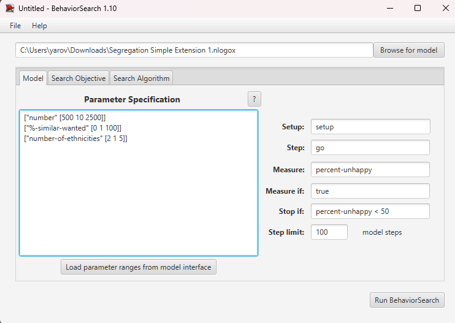
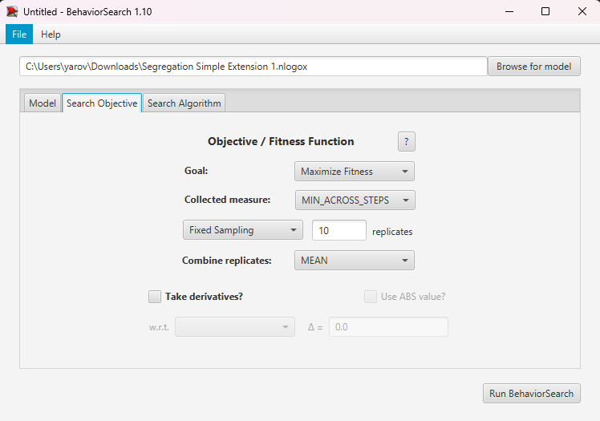
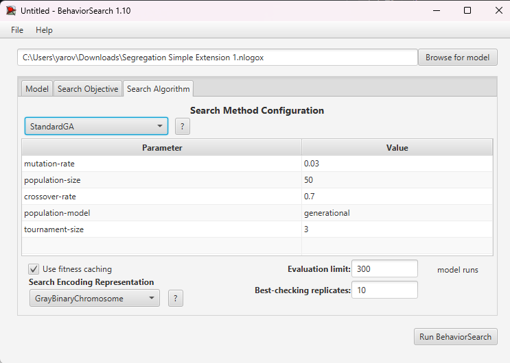
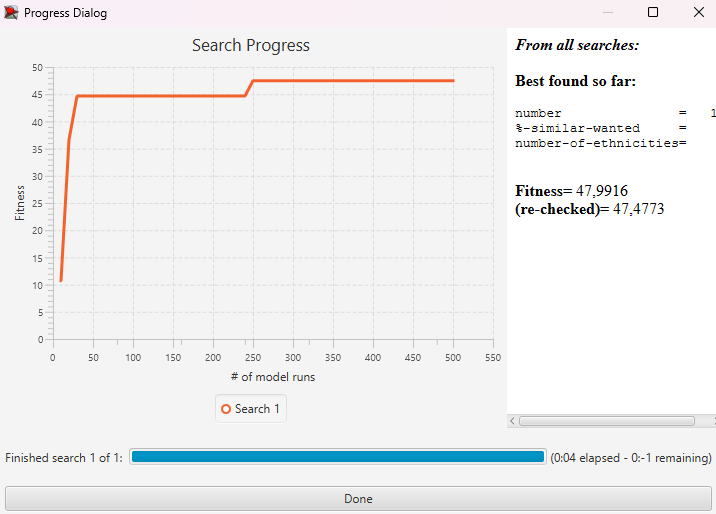
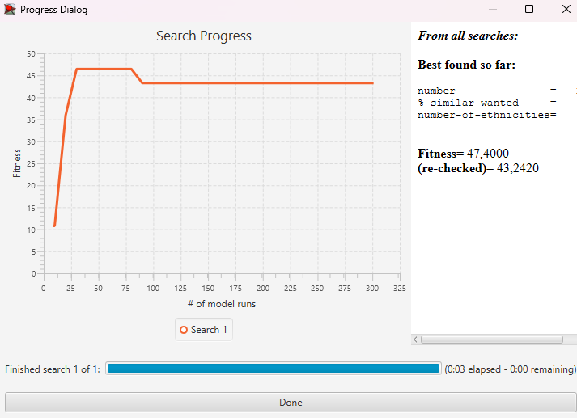

## Комп'ютерні системи імітаційного моделювання
## СПм-24-1, **Яровий Валерій Вікторович**
### Лабораторна робота №**3**. Використання засобів обчислювального інтелекту для оптимізації імітаційних моделей

 

### Варіант 8 - Модель досліджує прагнення "групуватися" із "своїми" і толерантність до чужаків.
[Segregation Simple Extension 1](https://www.netlogoweb.org/launch#http://www.netlogoweb.org/assets/modelslib/IABM%20Textbook/chapter%203/Segregation%20Extensions/Segregation%20Simple%20Extension%201.nlogo)

## Вербальний опис моделі
Модель показує соціальну сегрегацію: агенти різних груп (кольорів) переміщуються, якщо більшість сусідів іншого кольору і вони незадоволені. Також кожному агенту розраховується ймовірність зникнення vanish-prob залежно від кількості чужих сусідів і їхньої “сили” (наскільки ті оточені своїми). На кожному кроці агенти можуть зникати з цією ймовірністю, що змінює чисельність популяції.

## Керуючі параметри
- **number**  
	Кількість агентів у моделі. Впливає на щільність середовища та швидкість формування сегрегованих структур.
- **%-similar-wanted**  
	Мінімальний відсоток сусідів того ж кольору, необхідний агенту для того, щоб вважати себе щасливим. Чим більше значення, тим сильніша сегрегація.
- **number-of-ethnicities**  
	Кількість різних груп агентів. Колір кожного агента випадково обирається зі списку `colors`. Збільшення значення ускладнює структуру сегрегації.

## Внутрішні параметри (глобальні змінні)
- **percent-similar**  
	Середній відсоток сусідів того ж кольору для всіх агентів у системі.
- **percent-unhappy**  
	Відсоток агентів, які незадоволені своїм оточенням на поточному кроці моделювання.
- **colors**  
	Список можливих кольорів агентів:  
	`red, green, yellow, blue, orange`.

## Внутрішні параметри агентів
- **happy?**  
	Логічна змінна, що показує, чи задоволений агент своїм оточенням.
- **similar-nearby**  
	Кількість сусідів того ж кольору, що й агент.
- **total-nearby**  
	Загальна кількість сусідів незалежно від їх групи.
- **vanish-prob**
    Шанс зникання

## Налаштування середовища BehaviorSearch

Параметри та їх можливі діапазони були автоматично вилучені середовищем BehaviorSearch з інтерфейсу імітаційної моделі за допомогою кнопки **«Load parameters from model interface»**:

<pre>
["number" [500 10 2500]]
["%-similar-wanted" [0 1 100]]
["number-of-ethnicities" [2 1 5]]
</pre>

Діапазони значень параметрів були підібрані таким чином, щоб з одного боку охопити достатньо широкий простір пошуку, а з іншого - не надмірно збільшувати час симуляції:

### Використовувана міра

Для функції пристосованості було обрано значення кількості нещасливих агентыв: percent-unhappy

Цей показник безпосередньо характеризує ефективність розбиття на групи.

## Налаштування цільової функції (вкладка Search Objective)

У якості метрики якості моделі було обрано **percent-unhappy** — відсоток незадоволених агентів (черепашок).  
Ця величина показує, наскільки добре моделюється процес сегрегації: чим менше **percent-unhappy**, тим більше агентів задоволені своїм оточенням.

Оскільки значення **percent-unhappy** може змінюватися протягом симуляції, для параметра **Collected measure** обрали:

**MIN_ACROSS_STEPS**

Це означає, що з усіх значень percent-unhappy за весь час моделювання буде взято **мінімальне**.  
Тобто, мета пошуку — знайти такі параметри, при яких **найменша частка незадоволених агентів** (найкращий результат) досягається хоча б в якийсь момент симуляції.

## Налаштування алгоритму пошуку (вкладка Search Algorithm)

У ході лабораторної роботи використовувалися два алгоритми:

- **RandomSearch (випадковий пошук)**;
- **StandardGA (простий генетичний алгоритм)**.

Для обох алгоритмів було задано:

- **Evaluation limit** - 300.
- **Search Space Encoding Representation** - GrayBinaryChromosome.
- **Use fitness caching** - увімкнено.

## Результати використання BehaviorSearch

### Результати генетичного алгоритму

Результат пошуку параметрів імітаційної моделі, використовуючи випадковий пошук:

Результат пошуку параметрів імітаційної моделі, використовуючи генетичний алгоритм:

